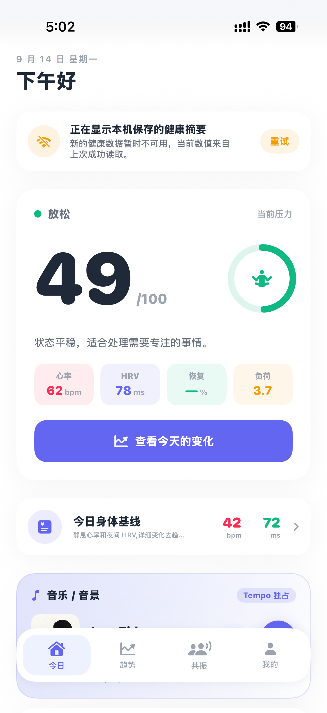
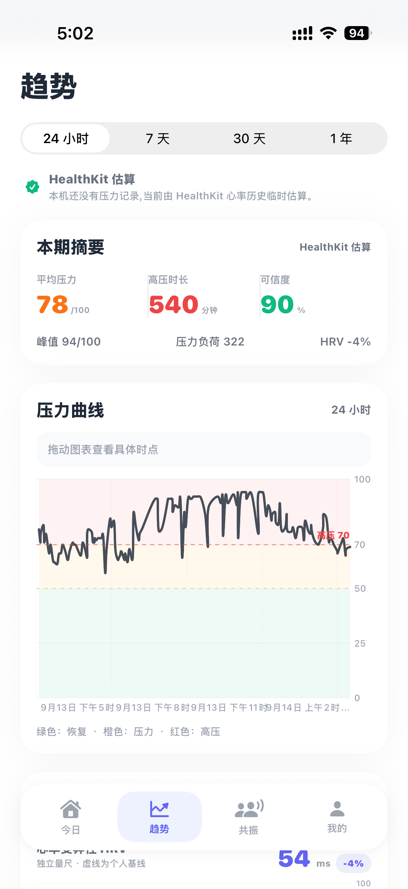
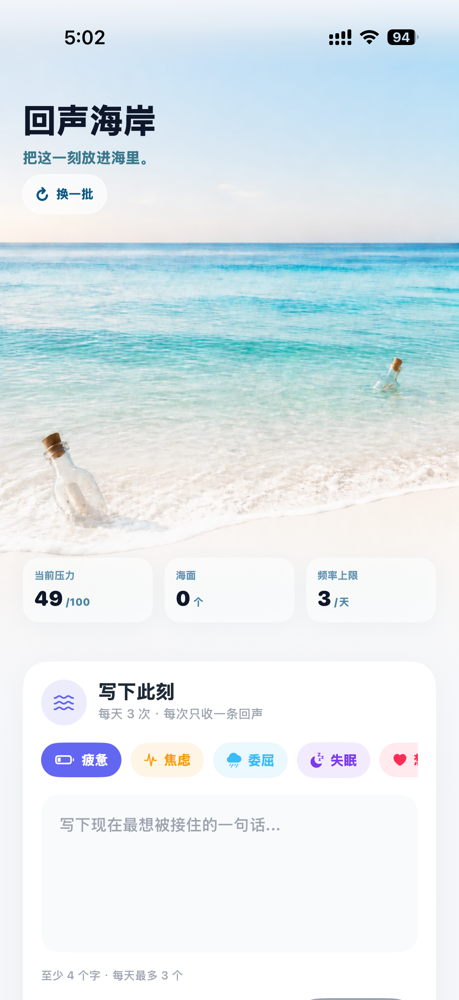
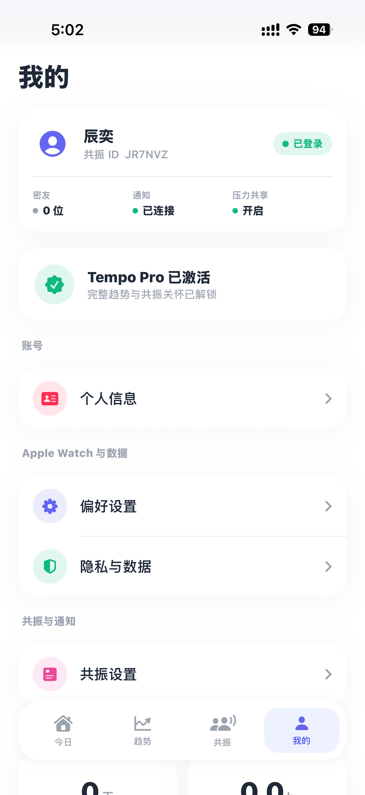

# Tempo — Stress & Resonance Care

<p align="center">
  
</p>

Tempo is an Apple-platform wellbeing app that combines Apple Watch–based stress tracking with a private resonance-care layer for close friends. It is built for iPhone, Apple Watch and WidgetKit, with a lightweight Hono backend for identity, friend relationships, care events and notifications.

> Tempo provides wellness insights and is not a medical diagnostic product.

## Product screenshots / 产品截图

<table>
  <tr>
    <td align="center"><b>Today / 今日</b><br></td>
    <td align="center"><b>Trends / 趋势</b><br></td>
  </tr>
  <tr>
    <td align="center"><b>Echo Coast / 回声海岸</b><br></td>
    <td align="center"><b>Profile / 我的</b><br></td>
  </tr>
</table>

## Product highlights

- Stress, HRV, recovery and strain trends based on HealthKit data
- iPhone + Apple Watch + Widget experience
- Close-friend resonance care: heartbeat, encouragement and status sharing
- Professional trend views, summaries and user-confirmed sharing cards
- Echo Coast drift-bottle interaction with filtering, reporting and blocking controls
- StoreKit 2 subscriptions and entitlement management
- Simplified Chinese / English in-app language switching
- Accessibility, offline states, cached content and retry feedback

## Architecture

```text
iPhone / Apple Watch / Widget
├── HealthKit + SwiftData + App Groups
├── WatchConnectivity + WidgetKit
├── StoreKit 2 + Sign in with Apple
└── HTTPS / APNs
        ↓
Hono API + SQLite
├── Session authentication
├── Friend relationships and care events
├── Push routing
└── Content moderation, reports and blocks
```

Raw HealthKit samples stay on the user’s Apple devices. When the user enables social features, Tempo sends the stress summaries, care events and user-generated content needed for friend sharing and Echo Coast to the backend.

## Technology

- Swift, SwiftUI, SwiftData and Swift Charts
- HealthKit, WatchConnectivity, WidgetKit and App Intents
- StoreKit 2, Sign in with Apple and APNs
- Hono / Node.js and SQLite
- XCTest and Swift Testing

## Repository layout

- `Tempo/` — iPhone application
- `Tempo Watch App Watch App/` — Apple Watch application
- `TempoWidgets/` — widgets
- `TempoCore/` — shared models and algorithms
- `server/` — Hono backend

## Local setup

1. Open `Tempo.xcodeproj` in Xcode.
2. Select your own development team and replace the example bundle/container identifiers where necessary.
3. Configure HealthKit, Sign in with Apple, App Groups and push capabilities.
4. Copy `server/.env.example` to `server/.env` and fill in local credentials.
5. Run `swift test` inside `TempoCore/`, then build the `Tempo` scheme.

Do not commit signing keys, provisioning profiles, `.env` files or production databases.

## Status

Active product development and App Store submission preparation.

## Ownership

Copyright © 2026 Chenyi Liu. All rights reserved. This repository is maintained as a portfolio and product-development record.
